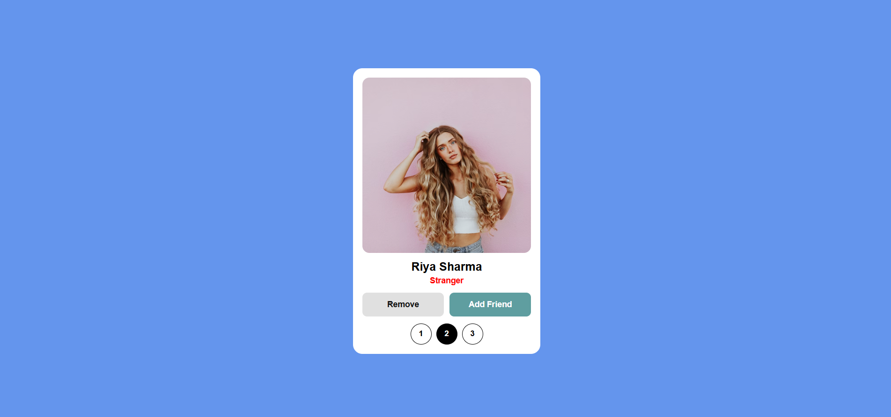
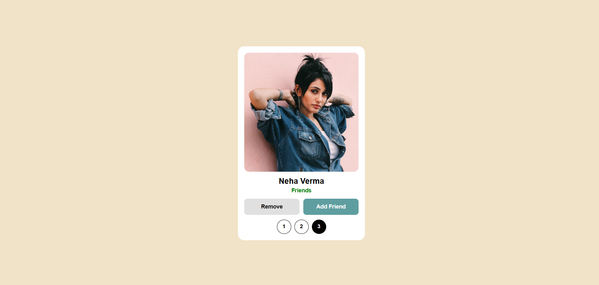

# Facebook Style Friend Request App

A Facebook-style friend request user interface built using modern frontend technologies.
This project focuses on UI interactions, smooth animations, and responsive design.

## 🔗 Live Demo
👉 https://sajjadali-fullstack.github.io/facebook-style-friend-request-app/

## ✨ Features
- Facebook-style friend request UI
- Accept / Cancel friend requests
- Smooth swipe interactions using Swiper.js
- Dynamic UI updates with JavaScript
- Responsive design for all screen sizes

## 🛠 Technologies Used
- HTML
- CSS
- JavaScript
- Swiper.js

## 📸 Screenshots

  
  
  

## 📚 What I Learned
- DOM manipulation using JavaScript
- Integrating third-party libraries (Swiper.js)
- UI state management
- Creating smooth and interactive user experiences
